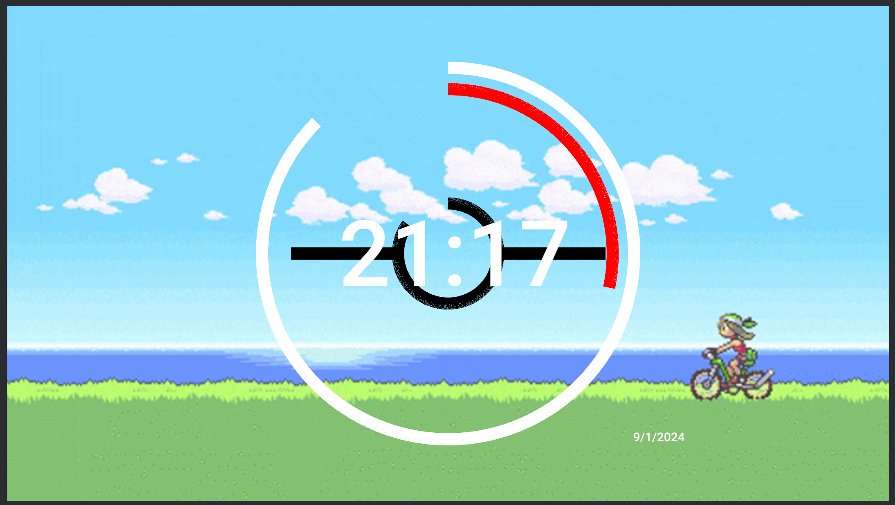

# Rust Pokeball Clock

This repo includes my efforts to create a small clock application in Rust using the game engine Bevy as GUI. The clock design was inspired by a Sci-fi looking clock design that as the time passes forms a Pokeball. The background includes a still from Pokemon emerald which is one of my favorite games from the series.

